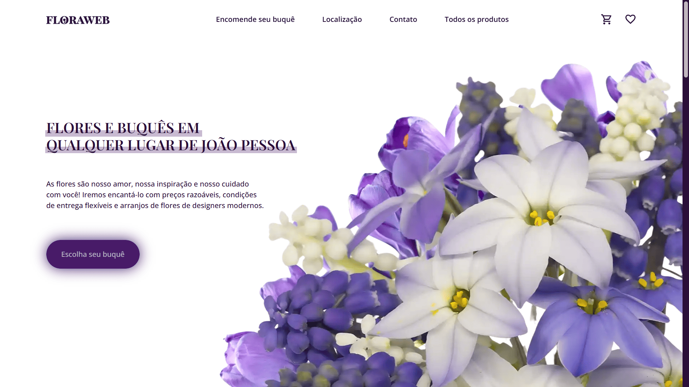

# Floricultura

> Status : Unfinished project 🕰️ / Open PR

## Markup Language | Graduation - Challenge

_Technologies_

+ Html5 
+ Css3 
+ SASS 🎨
+ AOS (Animate On Scroll) 📈

### How to use

- git clone https://github.com/12Gustavo21/floraweb.git or download the zip
- unzip if you download the zip
- code . (if you use VSCode)
- start a live server

## 💻 Online Page: https://floraweb.vercel.app